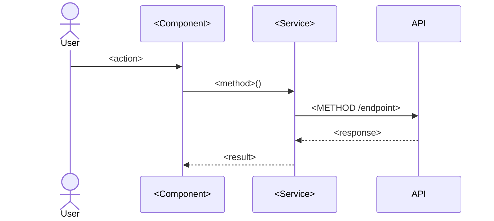

# HLD — <Module Name> (<MOD>)

> Rules: `HLD-Method.md`. Delete this line when filled in.

| Field | Value |
|---|---|
| **Mode** | As-built / Delta for <CR-nnn> |
| **FDS** | `Product/Modules/<Module>/FDS.md` |
| **Last updated** | <yyyy-mm-dd> · <RE-4 / CR-nnn> |

## H1 — Data

**Database**

| Table | Yii2 model | Key columns | Used for | Evidence |
|---|---|---|---|---|

**Client-side**

| Item | Kind | Shape / Key | Evidence |
|---|---|---|---|
| <`salah-reminder-preferences`> | localStorage | <`Record<SalahKey, SalahReminderPreference>`> | `path:line` |

## H2 — Process

### <Flow name>

## H3 — Rules (enforcement map)

| FDS ID | Enforced in | Evidence |
|---|---|---|
| <MOD>-BR-01 | Service / Component / API | `path:line` |

## H4 — API & Integration

| Endpoint | Method | Controller action | Auth | Request | Response | Evidence |
|---|---|---|---|---|---|---|
| `http-<controller>/<action>` | GET/POST | `api/controllers/<X>Controller.php::action<Y>` | Bearer / none | <fields> | <fields> | `path:line` |

**External:** <Play Store update check, analytics, maps — or `None.`>

## H5 — UI

| Screen / Dialog | Report | Navigates to |
|---|---|---|
| <SCR-nn> | `Product/Screens/<file>.md` | <SCR-nn, …> |

## H6 — Events & Native

| Item | Kind | Detail | Web | Android | Evidence |
|---|---|---|---|---|---|
| <Zikar reminder> | Local notification | channel `<id>`, sound `<file>` | <behaviour> | <behaviour> | `path:line` |

## Open Questions

1. <…>
